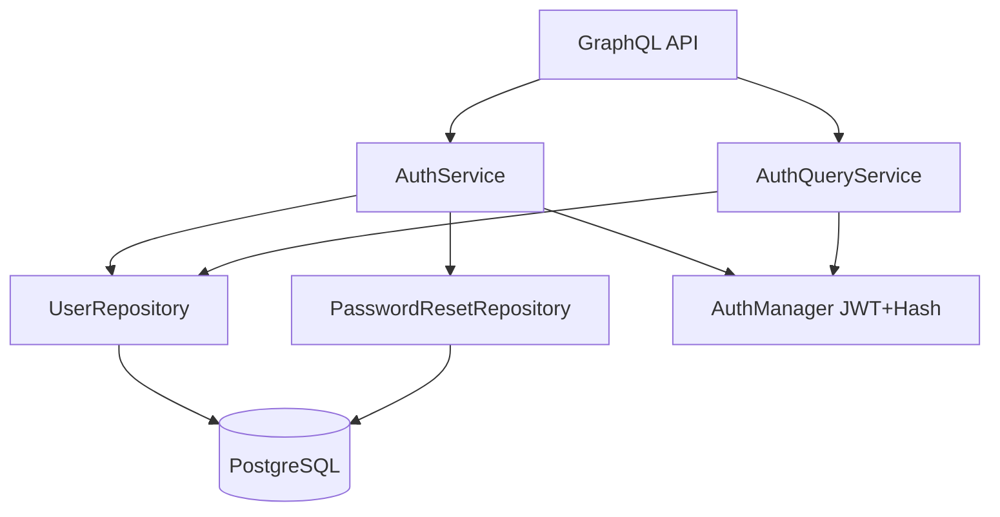

# Auth Challenge Solution

Минимальная, но инженерно аккуратная реализация модуля аутентификации для тестового задания.
Главный фокус: читаемая архитектура, прозрачные границы слоев и предсказуемый запуск.

## Используемый стек

- Python 3.14
- FastAPI
- Strawberry GraphQL
- PostgreSQL
- SQLAlchemy (async)
- asyncpg
- Docker Compose

## Почему выбран этот стек

- GraphQL, потому что я хорошо знаком с фреймворком Strawberry.
- FastAPI дает лаконичную HTTP-обвязку и я могу очень быстро собирать на нем прототипы.
- Async SQLAlchemy + asyncpg. Дефолт БД, дефолт ORM.

## Рассмотренные альтернативы

- `gRPC`: у меня нет опыта работы с ним напрямую.
- `REST only`: было бы гораздо проще, но к сожалению вы порицаете такой подход в рамках этого задания.

## Билд проекта

```bash
cp .env.example .env   # и сделаны были энвы по подобию моему  - (с) .env.example 
docker compose up --build
```

После запуска доступны:

- GraphQL: `http://localhost:8000/api/v1/graphql`
- Health: `http://localhost:8000/health`

## Как достать логи

По умолчанию приложение не пишет отдельные лог-файлы внутри репозитория.
Логи идут в stdout/stderr процессов, а дальше обрабатываются Docker logging driver.

### Логи в Docker

- Логи API в реальном времени:

```bash
docker compose logs -f app
```

- Откуда берутся:
- `uvicorn` (access/error logs).
- `auth_challenge` logger из middleware (`src/app/bootstrap.py`), где пишутся path/method/status/duration.
- Пишутся в stdout/stderr контейнера `app`.


- Если понадобитсч знать физический путь файла логов контейнера на хосте:

```bash
docker inspect -f '{{.LogPath}}' testtaskforkk-app-1
docker inspect -f '{{.LogPath}}' testtaskforkk-db-1
```

Примечание: формат и путь зависят от logging driver Docker (часто это `json-file`).

## Тесты

Тесты используют реальный PostgreSQL (`settings.database_url`), поэтому перед запуском тестов БД должна быть доступна.
Если это нежелательно, я пофикшу.

Если запускаете через Docker Compose:

```bash
docker compose up -d db
uv run pytest
```

## API доки

Сразу скажу, что в автоматически генерируемой swagger документации от FastAPI`localhost:8000/docs` не видно auth
операций. В проекте бизнес API реаизован через GraphQL, поэтому в `http://localhost:8000/docs` видны только
HTTP-обертки:

- `GET /api/v1/graphql`
- `POST /api/v1/graphql`
- `GET /health`

Сами auth-операции (`register`, `login`, `me`, `requestPasswordReset`, `resetPassword`) описаны в GraphQL schema.

### Где смотреть и как вызывать GraphQL

- Endpoint: `http://localhost:8000/api/v1/graphql`
- Метод: `POST`
- Формат тела: `{"query": "...", "variables": {...}}`

Примеры операций:

```graphql
mutation Register($inputData: RegisterInput!) {
  register(inputData: $inputData) {
    accessToken
  }
}
```

```graphql
mutation Login($inputData: LoginInput!) {
  login(inputData: $inputData) {
    accessToken
  }
}
```

```graphql
query {
  me {
    id
    username
    email
  }
}
```

## Архитектура

### Бизнес-контекст

Выделен один bounded context: `Identity/Auth`.
Он покрывает 3 сценария из задания:

- регистрация
- авторизация
- восстановление пароля

### Как ориентироваться в проекте

Быстрая карта проекта: `api -> services -> repositories -> db`.

1. API слой (`src/app/api/v1/*`)

- Файлы: [src/app/api/v1/__init__.py](src/app/api/v1/__init__.py), [src/app/api/v1/graphql.py](src/app/api/v1/graphql.py), [src/app/api/v1/contracts/auth_graphql.py](src/app/api/v1/contracts/auth_graphql.py)
- Роль: принять GraphQL-запрос, провалидировать контракт входа/выхода, вызвать сервис.
- бизнес-правил здесь нет

2. Domain services (`src/app/domain/services/*`)

- Файлы: [src/app/domain/services/auth_service.py](src/app/domain/services/auth_service.py), [src/app/domain/services/auth_query_service.py](src/app/domain/services/auth_query_service.py)
- Роль: бизнес-логика.
- CQRS command side: `AuthService` (`register`, `login`, `request_password_reset`, `reset_password`)
- CQRS query side: `AuthQueryService` (`get_me`)

3. Repositories (`src/app/domain/repositories/*`)

- Файлы: [src/app/domain/repositories/user_repository.py](src/app/domain/repositories/user_repository.py), [src/app/domain/repositories/password_reset_repository.py](src/app/domain/repositories/password_reset_repository.py)
- Роль: изолировать SQLAlchemy/БД доступ от бизнес-логики.
- Модели БД: `src/app/domain/models/db/*`.

4. Core infrastructure (`src/app/core/*`)

- DB wiring: [src/app/core/dependencies/db.py](src/app/core/dependencies/db.py)
- repository factories: [src/app/core/dependencies/repositories/user.py](src/app/core/dependencies/repositories/user.py), [src/app/core/dependencies/repositories/password_reset.py](src/app/core/dependencies/repositories/password_reset.py)
- service factories: [src/app/core/dependencies/services/auth.py](src/app/core/dependencies/services/auth.py)
- security dependencies: [src/app/core/dependencies/security/auth_manager.py](src/app/core/dependencies/security/auth_manager.py), [src/app/core/dependencies/security/crypt_context.py](src/app/core/dependencies/security/crypt_context.py), [src/app/core/dependencies/security/user.py](src/app/core/dependencies/security/user.py)
- security primitives: [src/app/core/security/auth_manager.py](src/app/core/security/auth_manager.py)
- domain exceptions: [src/app/core/exceptions/auth_exc.py](src/app/core/exceptions/auth_exc.py)

5. Composition root и entrypoint

- Composition root: [src/app/bootstrap.py](src/app/bootstrap.py) собирает приложение, middleware, lifespan и обработчики ошибок.
- Entry point: [src/main.py](src/main.py) экспортирует `app` для `uvicorn`.

### Поток запроса

1. GraphQL resolver принимает запрос.
2. Resolver вызывает command/query сервис.
3. Сервис применяет бизнес-правила.
4. Сервис обращается к репозиториям.
5. Репозитории работают с PostgreSQL через async SQLAlchemy session.

### Где в решении DDD

- Есть явная предметная область и граница контекста (`Identity/Auth`).
- Бизнес-правила находятся в доменных сервисах, API слой лишь обращается к нему как к своей ПЕШКЕ
- Доступ к данным изолирован в репозиториях.

### Где в решении CQRS

- `AuthService`: `register`, `login`, `request_password_reset`, `reset_password`.
- `AuthQueryService`: `get_me`.

### Где в решении IaC

- [docker-compose.yml](docker-compose.yml) 


## Ключевые правила домена

- Пароли хранятся только в виде hash (`passlib`, `pbkdf2_sha256`).
- Password policy: минимум 8 символов, обязательны uppercase/lowercase/digit/special, иначе казнь.
- JWT access token содержит `iat`, `exp`, `jti`.
- Reset token хранится в БД только как хеш
- Reset token имеет TTL.
- Reset token одноразовый.
- Reset token имеет cooldown между повторными запросами.
- При новом запросе reset token старые активные токены инвалидируются.
- Для неизвестного email в reset flow возвращается такой же успешный ответ (защита от email enumeration).

## Наблюдаемость

- Middleware-логирование: path, method, status и latency.

## Компромиссы (Trade-offs)

1. GraphQL вместо gRPC

- Плюс: проще интеграция и ручная проверка.
- Минус: контракт менее строгий, чем protobuf/gRPC.


## Какие расширения можно добавить благодаря особенностям построенной архитекткры

1. Вынести reset delivery в email provider и не возвращать raw token в API
2. Добавить Alembic-миграции
3. Добавить полноценный per-IP / per-user rate limiting
4. Добавить ротацию рефреш токенов и revocation strategy

## Архитектурная схема



## Pinterest links

- moodboard: https://ru.pinterest.com/i_walk_away/moodboard/
- anti-moodboard: https://ru.pinterest.com/i_walk_away/antimoodboard/

## Использование AI

Использовал ИИ для проверки моего кода на соответствие требованиям. 
